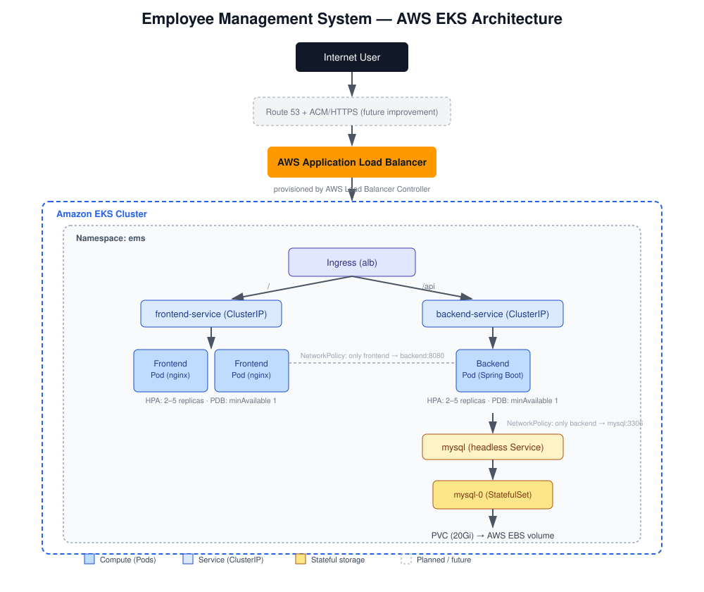
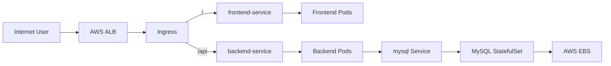

# Employee Management System — Production-Style 3-Tier Application on AWS EKS


## Overview

An Employee Management & HR Portal — a React frontend, a Spring Boot REST
API, and a MySQL database — deployed as a three-tier application on Amazon
EKS. Built as a DevOps/Kubernetes portfolio project: containerized with
Docker, deployed with hand-written Kubernetes manifests, and exposed
through an AWS Application Load Balancer via the AWS Load Balancer
Controller.

## Architecture





Full breakdown, including what's implemented vs. planned: [docs/architecture.md](docs/architecture.md).

## Technologies used

| Layer | Technology |
|---|---|
| Frontend | React (Vite), served by Nginx |
| Backend | Java 17, Spring Boot 3.3, Spring Security (JWT) |
| Database | MySQL 8.0 |
| Containerization | Docker (multi-stage builds) |
| Orchestration | Kubernetes on Amazon EKS |
| Ingress | AWS Application Load Balancer + AWS Load Balancer Controller |
| Persistent storage | Amazon EBS (via the EBS CSI driver) |
| Autoscaling | Kubernetes HPA (CPU-based) + Metrics Server |

## Project structure

```text
employee-management-system-eks/
│
├── README.md
├── APPLICATION_README_ORIGINAL.md   # the app's own README, kept for reference
├── LICENSE
├── .gitignore
├── .dockerignore
│
├── docs/
│   ├── architecture.md
│   ├── deployment-guide.md
│   ├── yaml-reference.md
│   ├── production-features.md
│   ├── troubleshooting.md
│   ├── interview-guide.md
│   ├── security.md
│   └── images/
│       └── architecture-diagram.svg
│
├── backend/                Spring Boot REST API
│   ├── Dockerfile
│   ├── pom.xml
│   └── src/
│
├── frontend/                React (Vite) SPA
│   ├── Dockerfile
│   ├── nginx.conf
│   ├── package.json
│   └── src/
│
├── database/
│   └── init/               Notes on schema/seed strategy
│
└── k8s/
    ├── 01-namespace.yaml
    ├── 02-secret.yaml.example
    ├── 03-configmap.yaml
    ├── 04-mysql-service.yaml
    ├── 05-mysql-statefulset.yaml
    ├── 06-backend-service.yaml
    ├── 07-backend-deployment.yaml
    ├── 08-backend-hpa.yaml
    ├── 09-backend-pdb.yaml
    ├── 10-frontend-service.yaml
    ├── 11-frontend-deployment.yaml
    ├── 12-frontend-hpa.yaml
    ├── 13-frontend-pdb.yaml
    ├── 14-ingress.yaml
    └── 15-network-policy.yaml
```

## Architecture explanation

- **Frontend** — a React SPA built with Vite, served as static files by
  Nginx. Runs as 2+ replicas behind `frontend-service` (ClusterIP).
- **Backend** — a Spring Boot REST API handling authentication (JWT),
  employee/department CRUD, and dashboard statistics. Runs as 2+ replicas
  behind `backend-service` (ClusterIP).
- **Database** — MySQL 8.0, run as a `StatefulSet` for stable identity and
  storage, backed by a `PersistentVolumeClaim` on Amazon EBS.
- **Ingress** — a single AWS ALB, managed by the AWS Load Balancer
  Controller, routes `/` to the frontend and `/api` to the backend. Neither
  the backend nor the database is ever exposed directly to the internet.

## Deployment

See the full step-by-step guide: [docs/deployment-guide.md](docs/deployment-guide.md).

Quick summary:
1. Build and push the backend and frontend Docker images.
2. Update the `image:` fields in `k8s/07-backend-deployment.yaml` and
   `k8s/11-frontend-deployment.yaml`.
3. Copy `k8s/02-secret.yaml.example` to `k8s/02-secret.yaml` and fill in
   real values (never commit this file).
4. Apply the manifests in numeric order (`01` → `15`), installing the AWS
   Load Balancer Controller before applying the Ingress.

## Kubernetes YAML reference

What every manifest does and why: [docs/yaml-reference.md](docs/yaml-reference.md).

## Production features

What's actually implemented and why it matters in production:
[docs/production-features.md](docs/production-features.md).

## Troubleshooting

Common failure modes and how to diagnose them:
[docs/troubleshooting.md](docs/troubleshooting.md).

## Security

What's implemented vs. recommended for a real production rollout:
[docs/security.md](docs/security.md).

## Interview guide

A 2-minute project explanation plus 35 practical Q&A:
[docs/interview-guide.md](docs/interview-guide.md).

## Request flow

```text
User → AWS ALB → Ingress
                    ├── /     → frontend-service → Frontend Pods
                    └── /api  → backend-service  → Backend Pods
                                                        └── mysql Service → MySQL StatefulSet → PVC → AWS EBS
```

## Key Kubernetes concepts demonstrated

`Deployment` · `StatefulSet` · `Service` (ClusterIP + headless) ·
`ConfigMap` · `Secret` · `HorizontalPodAutoscaler` · `PodDisruptionBudget` ·
`Ingress` · `NetworkPolicy` · `PersistentVolumeClaim` ·
readiness/liveness/startup probes · resource requests/limits

## Future improvements

Planned during the original design but **not implemented** in this
repository:

- **HTTPS via ACM** — terminate TLS at the ALB with an AWS Certificate
  Manager certificate.
- **Custom domain via Route 53** — point a real domain at the ALB instead
  of using the raw ALB hostname.
- **AWS Secrets Manager / External Secrets Operator** — replace the plain
  Kubernetes Secret with centrally managed, rotatable secrets.
- **Amazon RDS for MySQL** — move the database out of the cluster for
  managed backups, multi-AZ failover, and easier scaling.
- **GitOps (Argo CD)** — declarative, git-driven deployments instead of
  manual `kubectl apply`.
- **CI/CD pipeline** — automated build, test, image push, and deploy on
  every commit (e.g. GitHub Actions).
- **Centralized logging and monitoring** — e.g. Prometheus/Grafana or a
  managed alternative; currently there is no monitoring stack deployed.
- **Backup and disaster recovery** for the MySQL EBS volume.

## Notes on source material

This repository was assembled from a step-by-step implementation guide and
the application's own source code. Two things worth calling out:

- The application source didn't include a `docker-compose.yml`,
  Dockerfiles, or Kubernetes manifests, even though its own README
  described them — those were rebuilt here directly from the
  implementation guide, which is treated as the source of truth for
  infrastructure.
- The Ingress in the original guide had a copy-paste leftover
  (`namespace: three-tier`) that didn't match the `ems` namespace used
  everywhere else. This repo's `k8s/14-ingress.yaml` uses `ems` /
  `ems-ingress` to match the rest of the implementation — see
  [docs/yaml-reference.md](docs/yaml-reference.md#14-ingressyaml) for
  details.

## Important — before you deploy

- Replace `YOUR_DOCKERHUB_USERNAME/...` image references in
  `k8s/07-backend-deployment.yaml` and `k8s/11-frontend-deployment.yaml`
  with your actual pushed images.
- Copy `k8s/02-secret.yaml.example` → `k8s/02-secret.yaml` and replace
  every `<CHANGE_ME>` placeholder with a real value. **Never commit
  `k8s/02-secret.yaml`** — it's already in `.gitignore`.
- Restrict `CORS_ALLOWED_ORIGINS` in `k8s/03-configmap.yaml` from `*` to
  your actual frontend origin before any real deployment.
- Never commit real passwords, tokens, or AWS account IDs anywhere in this
  repository.
