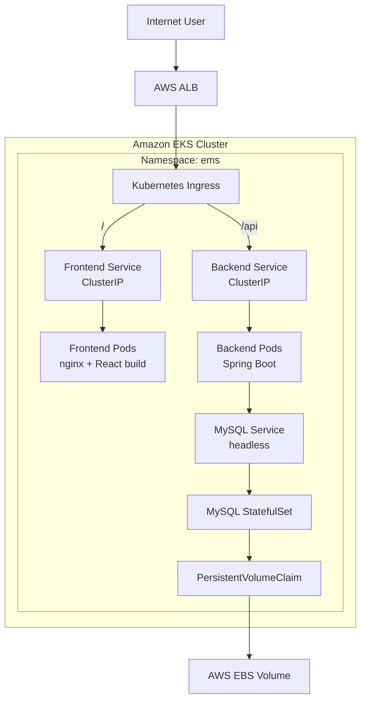

# Architecture

## Overview

The Employee Management System (EMS) is a three-tier web application deployed
on **Amazon EKS**. Traffic enters through an **AWS Application Load Balancer
(ALB)**, provisioned and managed by the **AWS Load Balancer Controller**
reacting to a Kubernetes `Ingress` resource. The Ingress splits traffic by
path: `/` goes to the React frontend, `/api` goes to the Spring Boot
backend. The backend talks to a MySQL database running as a `StatefulSet`
with persistent storage backed by **Amazon EBS**.



## Components actually implemented

| Layer | Technology | Kubernetes resource(s) |
|---|---|---|
| Frontend | React (Vite) served by Nginx | `Deployment`, `Service`, `HPA`, `PDB` |
| Backend | Spring Boot REST API | `Deployment`, `Service`, `HPA`, `PDB` |
| Database | MySQL 8.0 | `StatefulSet`, headless `Service`, `PVC` |
| Ingress / routing | AWS ALB + AWS Load Balancer Controller | `Ingress` |
| Config | Non-sensitive app settings | `ConfigMap` |
| Secrets | DB credentials, JWT secret | `Secret` |
| Isolation | `ems` namespace | `Namespace` |
| Traffic segmentation | Frontend → Backend → MySQL only | `NetworkPolicy` |
| Persistent storage | MySQL data directory | `PersistentVolumeClaim` on Amazon EBS (via the EBS CSI driver) |
| Autoscaling | CPU-based scaling for frontend and backend | `HorizontalPodAutoscaler` (requires Metrics Server) |
| Availability during disruption | Keep at least 1 pod up during voluntary disruptions | `PodDisruptionBudget` |

## Components referenced in planning but not yet implemented

The original implementation plan for this project also called out HTTPS/ACM,
Route 53, monitoring, and CI/CD. None of those were carried through in the
actual deployment steps that were executed — the guide's step-by-step
implementation stops after NetworkPolicy and ALB verification. They are
listed here for transparency and tracked as **future improvements** in the
main [README](../README.md#future-improvements), not as implemented
features.

## Request flow

```text
User
  |
  v
AWS ALB (internet-facing)
  |
  v
Kubernetes Ingress (ingressClassName: alb)
  |
  +---- / ------> frontend-service (ClusterIP) --> frontend Pods (nginx)
  |
  +---- /api ---> backend-service (ClusterIP) --> backend Pods (Spring Boot)
                                                        |
                                                        v
                                                  mysql (headless Service)
                                                        |
                                                        v
                                                     mysql-0 (StatefulSet Pod)
                                                        |
                                                        v
                                              PersistentVolumeClaim (mysql-data)
                                                        |
                                                        v
                                                    AWS EBS volume
```

**Why the frontend never talks to `backend-service` directly:** the React
app runs inside the user's browser, not inside the cluster, so it cannot
resolve internal Kubernetes DNS names like `backend-service:8080`. Instead,
the frontend calls a relative `/api` path, and the ALB Ingress routes that
path to the backend Service inside the cluster. This keeps the browser-facing
contract simple (`https://<your-domain>/api/...`) regardless of how the
backend is deployed internally.

## Namespace isolation

Every application resource lives in the `ems` namespace, keeping this
workload logically separated from anything else running on the shared EKS
cluster (other teams' workloads, `kube-system` components, etc.).
